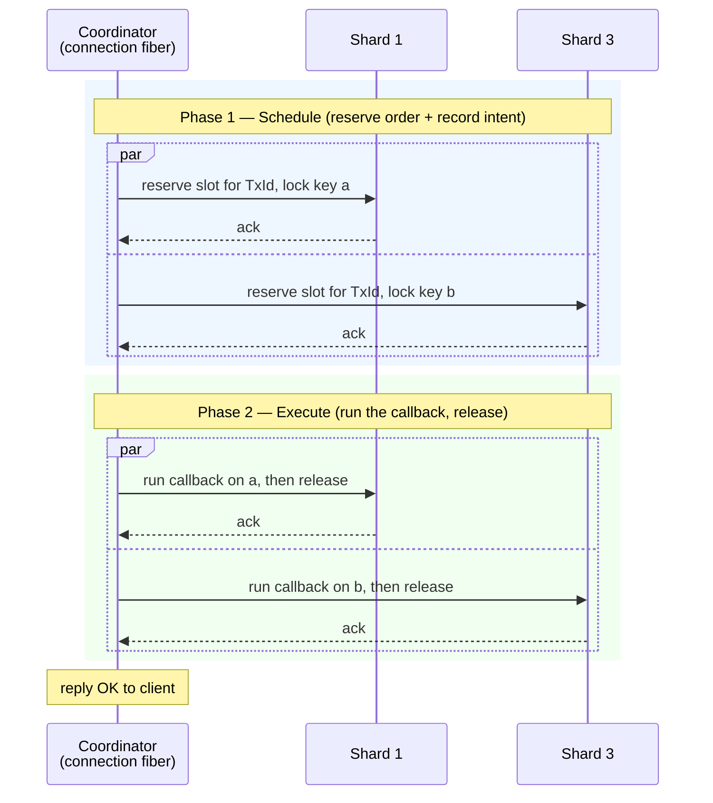

# Chapter 4 — The Transaction Model

> *Part III — Execution & Consistency*
>
> Prerequisite: [Chapter 1, The Shared-Nothing Architecture](./01-shared-nothing.md). This chapter
> assumes you know that each **shard** is owned by one thread and that other threads reach it only by
> posting callbacks to its **fiber queue**.

---

## Why this exists

Most commands touch a single key. `GET user:42`, `INCR counter`, `SET session abc` — each one lands on
exactly one shard, and because that shard is single-threaded, the operation is trivially atomic. There
is nothing to coordinate.

The interesting problems start when one command touches **several keys that live on different shards**.
Consider `MSET a 1 b 2` where `a` lives on shard 1 and `b` lives on shard 3. Or `RENAME src dst` where
the two keys hash to different shards. Or a `MULTI`/`EXEC` block, or a Lua script, that reads and
writes a dozen keys spread across the whole machine. Now two threads must cooperate, and the moment
two threads cooperate you have to answer hard questions:

- If two clients run `MSET a 1 b 2` and `MSET a 3 b 4` at the same time, can one client's write to `a`
  win while the other's write to `b` wins? (It must not — the result would be a state that neither
  transaction intended.)
- If client X reads `a` and `b` while client Y is writing both, can X see the new `a` but the old `b`?

Redis answers these questions the easy way: it is single-threaded, so there is only ever one
transaction executing and interleaving is impossible. That simplicity is also Redis's ceiling — one
core does all the work. A conventional multi-threaded store answers them with **locks**: grab a mutex
on every key you touch, in a canonical order to avoid deadlock, do the work, release. Locks are
correct but they are exactly the cross-core contention that Dragonfly's [shared-nothing
design](./01-shared-nothing.md) exists to avoid.

Dragonfly needs a third answer: **the strong guarantees of a serial order, at the throughput of a
lock-free, thread-per-core machine.** This chapter is about how it gets there.

The guarantee Dragonfly provides is **strict serializability**: the observable result of running
transactions concurrently is identical to running them one-at-a-time in *some* order, and that order
respects real time — if your `MSET` returns `OK` before my `MGET` starts, my `MGET` sees your writes.
A transaction's sub-operations never interleave with another's. (See the [glossary](./glossary.md) for
the precise definitions of serializability and strict serializability.)

The design is an adaptation of the academic **VLL** algorithm (Very Lightweight Locking) to
Dragonfly's fiber-based, shared-nothing world. You do not need the paper to follow this chapter.

---

## The big picture

Every command is run by a **coordinator** — the connection fiber handling that client. The coordinator
owns no data. It reaches shards only by posting callbacks to their fiber queues and awaiting the
replies. One such round trip — post to all involved shards, they run in parallel, wait for all — is a
**hop**.

A multi-shard transaction happens in two phases, each phase being one or more hops:



**Phase 1, Schedule:** the coordinator reserves the transaction a position in each shard's ordered
queue and records that it intends to touch certain keys. **Phase 2, Execute:** each shard runs the
actual work when the transaction reaches the front of its queue, then releases its hold.

Only the coordinator *fiber* waits during all this. Its thread keeps running other fibers — other
connections, other shards' work — so a "waiting" transaction stalls nothing.

That is the whole shape. The rest of the chapter fills in three things: how shards agree on an order,
how they avoid doing that expensive work for the common case, and how the guarantees survive every
race.

---

## Core concepts

### The shard is the lock

The first thing to internalize is that Dragonfly barely uses locks at all, because the shard's **fiber
queue** already provides mutual exclusion. Only one fiber touches a shard's data at a time — the one
currently running a callback from that shard's queue. So "run this on shard 3" is automatically
serialized against every other operation on shard 3. Half of transaction correctness is a free
consequence of the architecture from [Chapter 1](./01-shared-nothing.md).

What the architecture does *not* give you for free is agreement *across* shards. Shard 1 and shard 3
each serialize their own work, but nothing makes them agree that your transaction comes before mine on
*both*. That agreement is what the rest of the machinery builds.

### A global order: TxId and the tx-queue

To make shards agree, Dragonfly can stamp a transaction with a **TxId** — a number from a single
shared atomic counter, handed out in increasing order. Each shard keeps a **transaction queue**
(tx-queue): a list of the transactions scheduled on it, *sorted by TxId*.

Here is the elegant part. If every shard runs its transactions in TxId order, and TxIds come from one
global counter, then all shards execute conflicting transactions in the **same** order — even though
no shard ever talks to another shard. Transaction #5 runs before #6 on shard 1 and on shard 3 and on
every shard they share. The global counter is the only point of agreement, and each shard enforces the
order locally.

### Intent locks: recording what you *plan* to touch

When a transaction is scheduled on a shard, the shard records an **intent lock** on each of the
transaction's keys. An intent lock is not a mutex you block on; it is a pair of counters per key — one
counting transactions that intend to *read* (shared) the key, one counting those that intend to
*write* (exclusive) it.

Intent locks answer one question cheaply: **is this key contended?** A key is contended if two
transactions want to write it, or one wants to read while another wants to write. If a key is
*uncontended*, the transaction touching it cannot possibly conflict with anyone, which — as we will
see — unlocks Dragonfly's fast paths. Intent locks never block scheduling; they only record intent so
the shard can reason about conflicts.

### Everything above is usually skipped

Now the punchline that makes the whole design fast: **most transactions never allocate a TxId, never
enter a tx-queue, and never take the two-phase path at all.** The machinery above exists for the hard
cases — multi-shard transactions, and single-shard transactions that hit contention. The common case
is far cheaper, and it is where we start.

---

## How it works

### The fast path: single shard, uncontended

The overwhelming majority of real commands touch one shard and hit no contention. Dragonfly gives them
a path that skips essentially all of the transaction machinery.

The coordinator sends one scheduling message to the single target shard. On the shard, the transaction
takes intent locks on its keys and checks: *are these keys uncontended, and is this a one-hop command
that concludes right now?* If yes, the shard runs the command's callback **inline, during scheduling** —
right there, before returning. Locks are released immediately. No TxId is drawn from the global
counter. Nothing is inserted into the tx-queue. The coordinator gets its answer and replies.

This is called **optimistic execution**, and it is the single most important optimization in the
system. A `SET` or `GET` on an uncontended key costs one message to the owning shard, an inline
callback, and a reply — no global synchronization, no queue bookkeeping, no ordering. The expensive
atomic counter that all shards share stays completely off the hot path, which is essential: an atomic
counter incremented on every command would itself become the bottleneck the shared-nothing design was
built to avoid.

The counter is touched only when a transaction genuinely needs ordering. That is the guiding principle
of the whole model: **pay for coordination only when you actually have to coordinate.**

### The multi-shard path: schedule, then execute

When a transaction spans multiple shards, it needs a global order, so now we pay:

1. The coordinator draws a **TxId** from the global counter.
2. It sends a scheduling message to every shard the transaction touches.
3. Each shard takes intent locks on its share of the keys and inserts the transaction into its
   tx-queue at the position dictated by the TxId.
4. The coordinator waits for all shards to acknowledge.

Once scheduled, the transaction is *guaranteed to make progress* — it will never roll back. It sits in
each shard's tx-queue and, when it reaches the front, executes.

Execution is one or more **hops**. For each hop the coordinator "arms" the involved shards and asks
each to run the transaction's callback; each shard does so when the transaction is at the head of its
queue (with an important exception we will get to). On the final hop, the shard also releases the
intent locks and removes the transaction from its tx-queue. The coordinator waits on a shared counter
until every armed shard reports done, then moves on (to the next hop, or to replying).

Some commands need more than one execution hop. `RENAME src dst` is the classic example: hop one reads
`src` and `dst` from their shards and hands the values back to the coordinator; the coordinator decides
what to do; hop two writes `dst` and deletes `src`. `MSET a 1 b 2`, by contrast, needs just one
execution hop — each shard writes its own key in parallel.

### Doing better than strict queue order: out-of-order execution

Strict "run in tx-queue order" is correct but leaves performance on the table. Suppose transaction #6
is scheduled on a shard behind transaction #5, but #5 and #6 touch completely different keys. Making
#6 wait for #5 is pointless — they do not conflict.

This is exactly what intent locks are for. When a transaction is scheduled and finds all of its keys
**uncontended**, the shard marks it for **out-of-order execution**: it may run immediately, ahead of
earlier transactions in the queue, without waiting. It is safe by construction — the only way to earn
the out-of-order flag is to have no conflict with anything else in the queue. Only when a key is
contended does the transaction fall back to waiting its turn at the head of the queue. In practice,
because most transactions touch disjoint keys, out-of-order execution keeps shards busy instead of
idling behind unrelated work.

### Inline execution — a shortcut with teeth

There is one more optimization, and it is worth understanding both because it is clever and because it
has historically been a source of subtle bugs.

Normally the coordinator posts a message to a shard's fiber queue and the shard's queue fiber runs it.
But sometimes the coordinator fiber is *already running on the very thread that owns the target shard*.
In that case, posting a message to the queue is wasteful — the coordinator could just call the
scheduling and execution logic directly, on its own fiber. This is **inline execution**, and for
high-throughput single-shard workloads it removes real overhead.

The subtlety: normally, every shard callback runs on the shard's dedicated queue fiber, one at a time,
which guarantees a running callback has the shard entirely to itself until it finishes. Inline
execution breaks that assumption, because now the callback runs on the *coordinator's* fiber. If that
callback **yields** — does any I/O, or hits a suspension point — the shard's own queue fiber can wake
up and start another transaction on the same keys *in parallel with the suspended one*. Two callbacks
touching the same keys at once is precisely the atomicity violation the whole chapter is about.

The root cause is that intent locks record *intent*, not *in-progress execution*. A suspended inline
callback still holds its locks, but the queue fiber only sees "locks acquired" and — if the inline
transaction was marked out-of-order — may happily let another uncontended transaction proceed.

Dragonfly's defense is to permit inline execution **only when the callback provably cannot yield**. In
practice that rules it out when replication journaling is active (journal callbacks iterate listeners
and may preempt), when the shard has registered change callbacks (snapshotting), during the LOADING
state of a full sync, and for global transactions. The rule to carry away: *any feature that adds a
suspension point to a shard callback must either disable inlining or guarantee the callback stays
non-suspending.* This is the kind of invariant that is obvious once stated and disastrous when
forgotten.

### Global transactions

A few commands must touch *every* shard: `FLUSHALL`, `FLUSHDB`, `SAVE`, `MOVE` between databases, and
similar. These run as **global transactions**. Instead of locking individual keys, a global transaction
takes a *shard-level* lock on every shard, which prevents any other transaction from executing until it
completes. This is correct but heavy — it serializes the entire machine for the duration — so global
transactions are kept off hot paths by design.

### Multi-key transactions and squashing

`MULTI`/`EXEC` blocks and Lua scripts are **multi-transactions**: a single Dragonfly transaction that
runs a *sequence* of commands. Rather than reschedule for each command, a multi-transaction schedules
once — locking all the keys it will touch up front — and then runs its commands as consecutive hops
while holding those locks. The individual commands do not even know they are inside a larger
transaction; the framework makes it transparent.

Running those commands one at a time would waste the multi-core machine: each command would be its own
cross-thread hop, executed sequentially. **Command squashing** fixes this. Given a run of single-shard
commands inside an atomic multi-transaction, Dragonfly groups them by target shard — preserving order
within each shard — and dispatches all shards in a *single parallel hop*. Six commands spread across
three shards become one hop with three shards working at once instead of six sequential round trips.
Each shard receives a lightweight "stub" transaction that presents the normal transaction interface to
the individual commands, while a parent transaction coordinates the single hop.

---

## A worked example

Let us trace two concrete scenarios: the happy path, and the race that forces a retry.

### `MSET a 1 b 2` with `a` on shard 1 and `b` on shard 3

This spans two shards, so it takes the multi-shard path. The coordinator draws TxId = 5, schedules on
shards 1 and 3 (each takes an exclusive intent lock on its key and queues the transaction), then runs
one execution hop: shard 1 writes `a=1`, shard 3 writes `b=2`, in parallel. Both release their locks
and dequeue on this concluding hop. The coordinator replies `OK`. Because both keys were exclusively
intended by the same transaction, no other transaction could interleave a write to `a` or `b` between
the two — the `MSET` is atomic across shards.

### The scheduling race, and why scheduling can fail

Here is the case the design has to survive. Two clients issue conflicting multi-shard transactions at
almost the same instant:

- Coordinator C1 schedules **T1** with **TxId = 5**, touching key `a` (shard 1) and key `b` (shard 3).
- Coordinator C2 schedules **T2** with **TxId = 6**, touching the same `a` and `b`.

Messages between coordinators and shards are asynchronous, so they can arrive in different orders on
different shards:

```
Shard 1 receives:  T2 (id 6) first, then T1 (id 5)
Shard 3 receives:  T1 (id 5) first, then T2 (id 6)
```

On shard 3, T1 arrives first and sits at the front; T2 queues behind it. Fine — that matches TxId
order. On shard 1, T2 (id 6) arrives *first*. Then T1 (id 5) shows up and must be inserted **ahead** of
T2, because the queue is ordered by TxId. If `a` were uncontended this late insertion would be
harmless. But T1 and T2 both want to write `a` — they conflict — and T2 may already have begun
executing out of order. Inserting T1 in front of an already-committed-to-position, conflicting T2 would
violate the ordering the two shards are supposed to share.

So shard 1 **fails the scheduling** of T1. The coordinator sees the failure, cancels T1 on every shard
it managed to schedule on (reverting the intent locks and queue insertions), draws a **fresh, larger
TxId**, and tries again. With the new id, T1 is no longer a "late arrival" that must jump the queue,
and scheduling succeeds. The client never sees any of this; it just experiences a slightly longer
latency on a rare occasion. And it *is* rare — the conflict requires two multi-shard transactions on
overlapping keys arriving interleaved, which disjoint-key workloads essentially never hit.

This retry-on-conflict is the price of establishing a global order without any shard-to-shard
communication. It is a good trade: the common case pays nothing, and the rare case pays a retry rather
than every case paying for coordination.

---

## Invariants and edge cases

**Why the result is strictly serializable.** Every conflicting pair of transactions is ordered by
TxId, and every shard executes conflicting transactions in TxId order. So there exists one global
serial order (by TxId) that all shards respect for conflicting work. Non-conflicting transactions may
run in any relative order — but since they do not conflict, no observer can tell, which is exactly what
serializability permits. Real-time ordering holds because a transaction that has *finished* has already
released its locks and left the queues, so a later transaction that starts afterward is scheduled with
a larger TxId and sees its effects.

**A TxId of zero means "never needed one."** Because the fast path never allocates a TxId, an unset
TxId is not transaction number zero — it means the transaction never required a global order. Treating
it as a real position would be a bug.

**Intent is not execution.** The recurring hazard, seen in inline execution, is conflating "the locks
are held" with "no callback is currently running on these keys." Intent locks track the former. Any
code path that lets a callback suspend while inlined breaks the latter. This is the one place where the
otherwise-free "shard is the lock" guarantee can be lost, and it must be actively protected.

**Blocking commands hold their locks while they sleep.** `BLPOP`, `BRPOP`, and friends are the most
intricate transaction type, because they must watch several keys across shards and wake the instant any
of them gets data — all while preserving strict serializability. The mechanism:

```mermaid
sequenceDiagram
    participant C1 as BLPOP coordinator
    participant S1 as Shard 1 (key X)
    participant S2 as Shard 2 (key Y)
    participant C2 as LPUSH coordinator

    note over C1: BLPOP X Y 0
    par schedule + check
        C1->>S1: is X non-empty?
        S1-->>C1: empty
    and
        C1->>S2: is Y non-empty?
        S2-->>C1: empty
    end

    note over C1: all empty → suspend
    par register watches (concluding hop)
        C1->>S1: watch X — leave tx-queue, KEEP locks
        C1->>S2: watch Y — leave tx-queue, KEEP locks
    end
    note over C1: fiber blocks; not in any queue,<br/>but still holds intent locks on X and Y

    note over C2: another client: LPUSH Y val
    C2->>S2: push to Y
    S2->>C1: notify: woken on key Y

    par pop from wake key (highest priority)
        C1->>S1: release locks on X
        C1->>S2: pop Y, release locks
    end
    note over C1: return ("Y", "val")
```

The transaction schedules normally and checks its keys. If any key already has data, it pops and
returns — no blocking. If all keys are empty, it runs a concluding hop that registers watches and
*removes itself from the tx-queues but keeps its intent locks held*. Then the coordinator fiber simply
blocks. Because the locks stay held, no other transaction can interleave on the watched keys. When some
other client pushes to a watched key, the shard notifies the sleeping transaction; the first
notification to win records the wake key. The woken transaction re-runs to pop from that key — running
with top priority so it bypasses the tx-queue — and releases its locks on the way out. If the timeout
fires first, a cleanup path releases the locks and unregisters the watches instead. Two consequences
worth noting: a `BLPOP` *inside* a `MULTI`/`EXEC` does not block (it returns immediately, per Redis
semantics), and when a multi-key push happens atomically, a blocked `BLPOP` is only woken after the
whole pushing transaction completes.

---

## Trade-offs

**What the design buys.** Strict serializability across an arbitrarily sharded, lock-free, thread-per-
core machine — with the common single-key command paying essentially nothing for it. The global atomic
counter, the one unavoidable point of contention, is touched only by transactions that genuinely need
ordering.

**What it costs.** Multi-shard transactions pay for coordination: a global TxId, a scheduling hop, and
occasionally a retry when conflicting transactions race into the queues in a bad order. Global
transactions (`FLUSHALL` and kin) serialize the entire machine and must be kept off hot paths. And the
inline-execution optimization imposes a permanent tax on contributors: every new suspension point in a
shard callback has to be checked against the inlining rules.

**The alternative not taken.** Classic per-key mutex locking would also be correct, and simpler to
reason about in isolation. Dragonfly rejects it because the locks themselves are the cross-core
contention the whole architecture is designed to eliminate. The transaction model is what lets
Dragonfly keep the strong guarantees of locking while paying the coordination cost only on the small
fraction of commands that actually span shards or contend.

---

## Key takeaways

- Each shard is single-threaded, so single-key operations are atomic for free; the transaction model
  exists to coordinate operations that span **multiple shards**.
- A single global **TxId** counter plus per-shard **tx-queues ordered by TxId** make all shards agree
  on one execution order **without any shard-to-shard communication**.
- **Most commands skip all of it.** Single-shard, uncontended commands run inline during scheduling,
  never drawing a TxId or entering a queue — coordination is paid for only when needed.
- **Intent locks** record what a transaction plans to touch; uncontended keys unlock **out-of-order**
  and **inline** execution, the model's two big speedups.
- **Inline execution** is fast but unsafe if a callback can yield — hence a strict rule against
  inlining when suspension is possible.
- The design gives **strict serializability**; the rare cost is a **scheduling retry** when conflicting
  multi-shard transactions race, and the heavy cost is **global transactions**, which serialize
  everything.
- **Blocking commands** keep their intent locks held while suspended, so they observe multiple keys
  across shards without breaking atomicity.

---

## Going deeper

- The design document [`docs/transaction.md`](../../transaction.md) covers the same model with the
  VLL paper reference and additional detail on multi-modes and squashing.
- The [Code Map appendix](../implementation-notes.md#transaction-model) points to the exact classes and
  functions (`Transaction`, `ScheduleInShard`, `RunInShard`, `PollExecution`, and the `LocalMask` /
  `CoordinatorState` flags) for readers who want to read the implementation.
- Related chapters: [Chapter 1, Shared-Nothing Architecture](./01-shared-nothing.md) for the fiber-
  queue foundation, and [Chapter 8, Shard Serialization](./08-shard-serialization.md) for how the
  change callbacks that gate inline execution power snapshots and replication.
